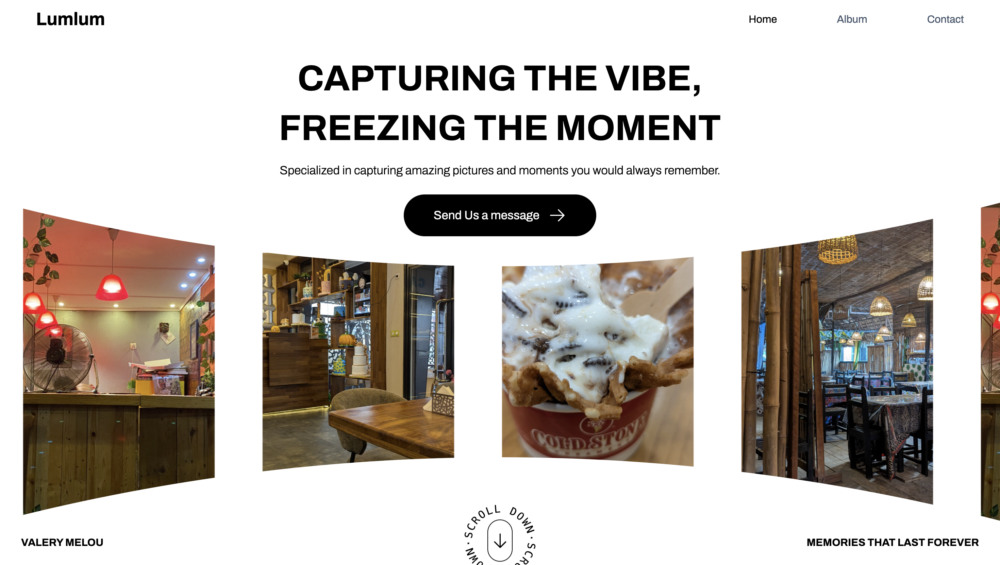

# Photography Studio Hero

A hero section for a photography studio.

## Screenshot



## Technologies

- Vite
- Tailwind CSS

## Launch Instructions

1.  Clone the repository:

    ```bash
    git clone https://github.com/valerymelou/photography-studio-hero.git
    ```

2.  Navigate to the project directory:

    ```bash
    cd photography-studio-hero
    ```

3.  Install the dependencies:

    ```bash
    yarn
    ```

4.  Start the development server:

    ```bash
    yarn dev
    ```

    This will start the development server. Open your browser and navigate to the address provided (usually `http://localhost:5173/`) to view the project.

## Credits

Design by [Oluwapelumi](https://x.com/Unebelle_fille).
